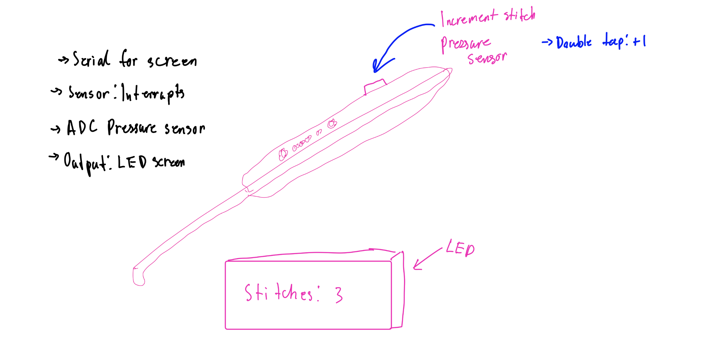
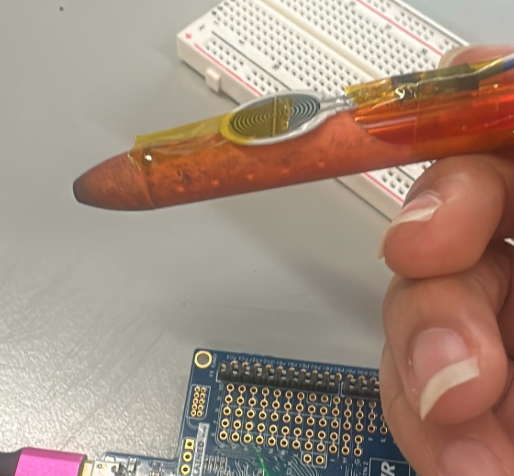
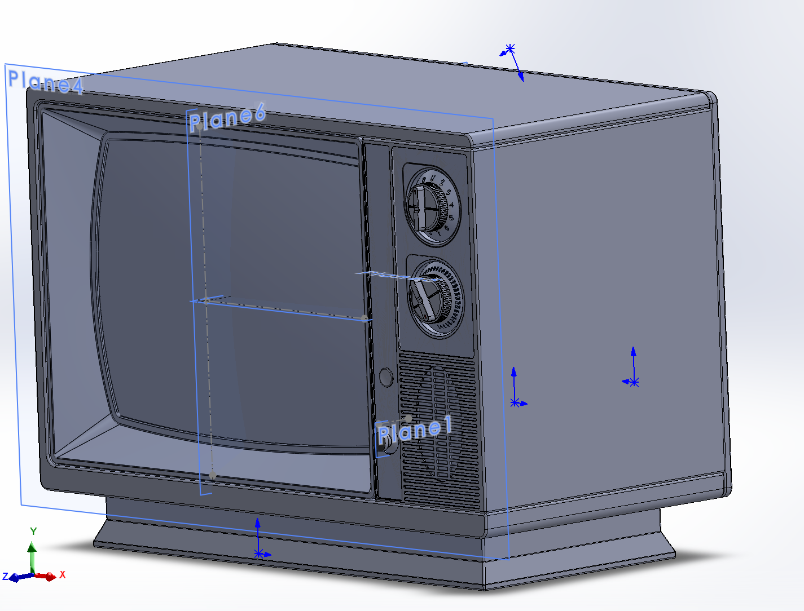
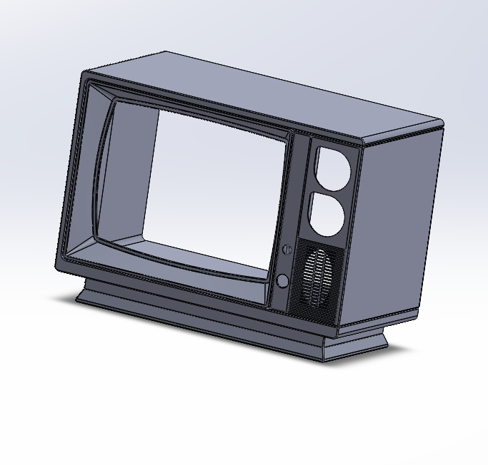
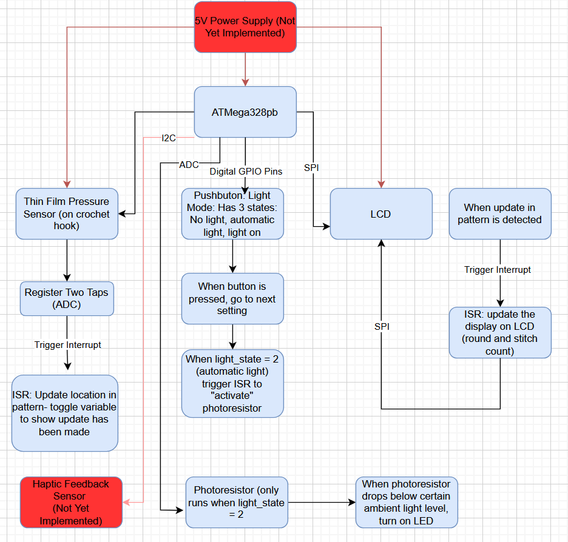
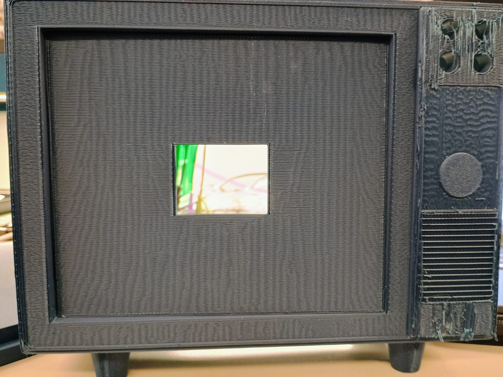
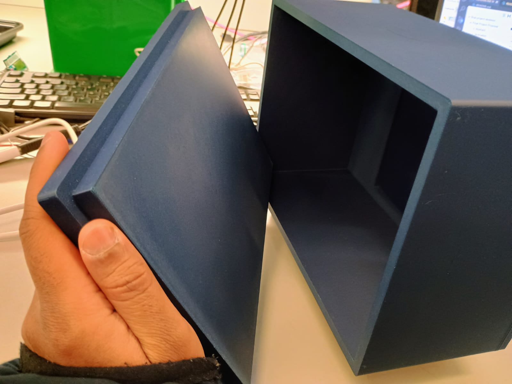
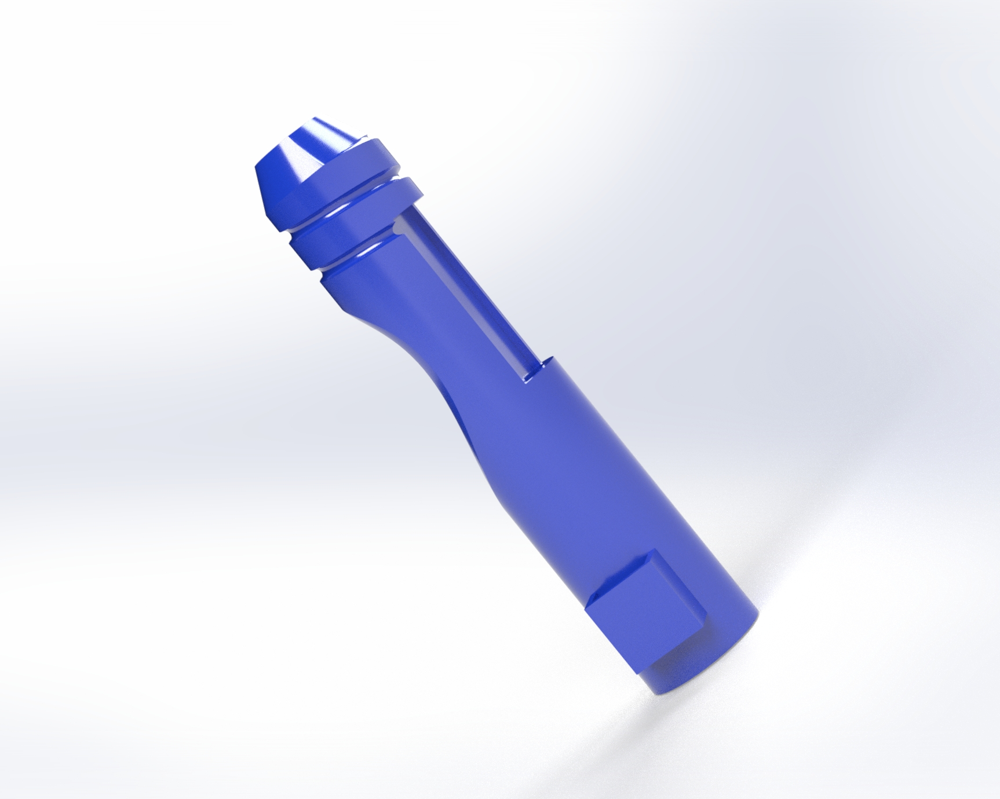
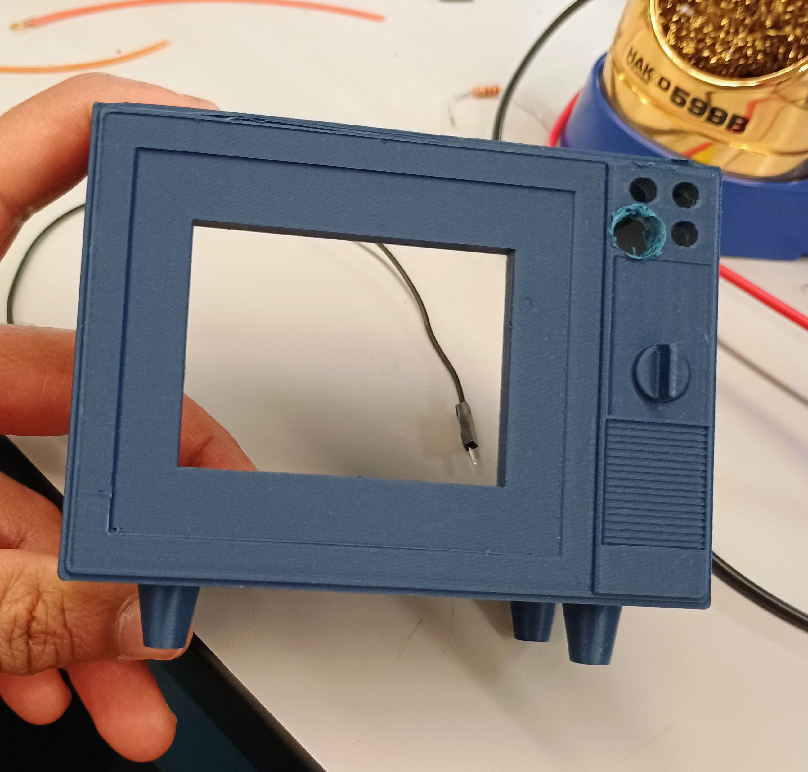
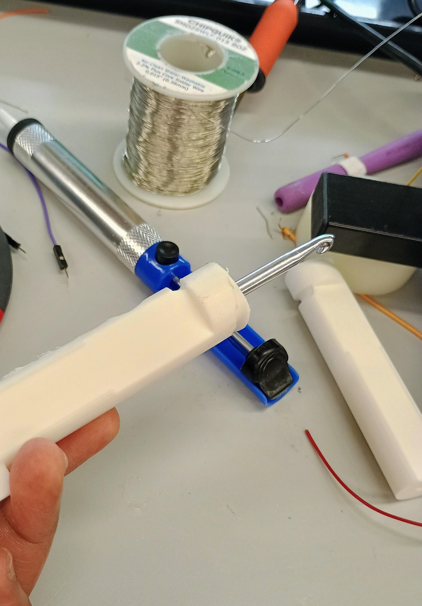

# final-project-skeleton

* **Team Number: 13**
* **Team Name: 𓆝 𓆟 slay 𓆞 𓆝**
* **Team Members: Hansika Doria, Amehja Williams, Parisa Khashayar**
* **GitHub Repository URL: https://github.com/upenn-embedded/final-project-s25-slay.git**
* **GitHub Pages Website URL: [for final submission]**

## Final Project Proposal

### 1. Abstract

*In a few sentences, describe your final project.*

> Our final project is a smart crochet hook. You will be able to upload a text file of a crochet pattern which will be displayed on an LCD screen. Using a pressure sensor on the needle, the user can signify when they have completed a stitch, and the LCD will update the pattern accordingly to keep track of where the user is in the pattern.

### 2. Motivation

*What is the problem that you are trying to solve? Why is this project interesting? What is the intended purpose?*

> When crocheting one needs to count the number of stitches they have made in order to ensure the dimensions of their project fit criteria. Oftentimes, this can be time-consuming and burdensome, especially for beginners.  The smart crochet needle attachment will be compatible with existing needles while enhancing crochet experience for newcomers and experts alike.  The attachment will track the number of stitches for artists.
>
> The most interesting aspect of this project is that the stitch count can be incremented or decremented by simply double-tapping or triple-tapping, respectively, the touch sensor.
>
> Overall, the purpose of the smart crochet needle attachment is to make stitch counting more efficient and streamlined for the crochet community.

### 3. System Block Diagram

*Show your high level design, as done in WS1 and WS2. What are the critical components in your system? How do they communicate (I2C?, interrupts, ADC, etc.)? What power regulation do you need?*

### 4. Design Sketches

*What will your project look like? Do you have any critical design features? Will you need any special manufacturing techniques to achieve your vision, like power tools, laser cutting, or 3D printing?*

> The project would be an attachment that can be added to a crochet hook such that the user can easily access the sensor used to determine when a stitch is complete. The casing of the attachment could be 3D printed along with what’s holding the LCD screen that is being used to keep track of the pattern and the stitch the user is on. Additionally, the components that are used in the attachment itself must be small but we would have an additional casing for other components not attached to the hook which do not have size constraints.

### 5. Software Requirements Specification (SRS)

*Formulate key software requirements here. Think deeply on the design: What must your device do? How will you measure this during validation testing? Create 4 to 8 critical system requirements.*

*These must be testable! See the Final Project Manual Appendix for details. Refer to the table below; replace these examples with your own.*

> 1: The text file pattern that is uploaded must be kept updated at all times so that the user is crocheting correctly. This means that the interrupts that change the crochet pattern must work consistently
>
> 2: It’s important to make sure that the photoresistor does not toggle the LED when it is not supposed to. Ensuring that it is only controlling the LED when in the correct setting/mode.
>
> 3: Since the pressure sensor is in easy reach, it is very likely that the user will accidentally brush by it every so often. This means that in the code we need to make sure it can handle the difference between an intentional press and an accidental one. This can be handled with how long and hard the sensor  has been pressed on, as well as needing two presses to indicate a complete stitch.
>
> 4: Since the crochet pattern will be uploaded as a text file, we need to write a program that is able to understand the layout of crochet patterns. In order to keep track of the user's place, the code needs to know what each possible symbol means and how to decode it into a list of rounds and its subsequent stitches.

**5.1 Definitions, Abbreviations**

Here, you will define any special terms, acronyms, or abbreviations you plan to use for software

**5.2 Functionality**

| ID     | Description                                                                                                                    |
| ------ | ------------------------------------------------------------------------------------------------------------------------------ |
| SRS-01 | Upon a completed stitch, the current pointer of the pattern must update to the next stitch and show accordingly on the LCD     |
| SRS-02 | The photoresistor will only control the LED when the light_state mode is set to 2 (automatic light).                           |
| SRS-03 | Upon two significant (and non-accidental presses), the system will recognize a complete stitch and move along in the pattern.a |
| SRS-04 | The system must be able to create an array/list of the stitches and rounds once a pattern has been uploaded.                   |

### 6. Hardware Requirements Specification (HRS)

*Formulate key hardware requirements here. Think deeply on the design: What must your device do? How will you measure this during validation testing? Create 4 to 8 critical system requirements.*

*These must be testable! See the Final Project Manual Appendix for details. Refer to the table below; replace these examples with your own.*

> 1. A pressure sensor is required as the sensor used by the user to indicate when a stitch is complete. The data from this sensor can then be communicated to the MCU which then will adjust the counter being used to count down the pre-set amount of stitches required for the pattern that is being used. This can be measured through validation testing when a simple stitch pattern with a known amount of stitches is uploaded and the correct numbers decrementing can then be tested.
> 2. This value can then be displayed on the LCD which can also be tested by ensuring the correct number is being displayed by the LCD.
> 3. A photoresistor can be used, which would require an ADC pin to be used which can determine how light it is in order to turn an LED on in case the user is crocheting in the dark. The LED can have 3 settings which can be changed using a push button with 3 settings, light off, light on, and light adjusting based on the photoresistor. This can be tested by using the duty cycle to check how bright the LED is.
> 4. In addition, 2 coin cell batteries each supplying 3V will be put in series to have a 6V power source. This value can be measured to ensure that the value being outputted by the battery is as expected
> 5. The 6V power source needs to be brought down to 5V as per the requirements of the other components involved. Therefore a buck converter is necessary to bring the voltage down to the desired amount.

**6.1 Definitions, Abbreviations**

Here, you will define any special terms, acronyms, or abbreviations you plan to use for hardware

**6.2 Functionality**

| ID     | Description                                                                                                                            |
| ------ | -------------------------------------------------------------------------------------------------------------------------------------- |
| HRS-01 | A pressure sensor shall be used for stitch detection. The sensor shall detect two presses from the user to indicate a complete stitch. |
| HRS-02 | An LCD will be used to display the user's current pattern round, which will be updated via input from the pressure sensor.             |
| HRS-03 | A photoresistor will be used to detect when the LED should turn on to give the user light.                                             |
| HRS-04 | Two coin cell batteries will be used to power everything.                                                                              |
| HRS-05 | A buck converter will be used to step down the voltage from the two coin cell batteries (6V) to 5v.                                    |

### 7. Bill of Materials (BOM)

*What major components do you need and why? Try to be as specific as possible. Your Hardware & Software Requirements Specifications should inform your component choices.*

*In addition to this written response, copy the Final Project BOM Google Sheet and fill it out with your critical components (think: processors, sensors, actuators). Include the link to your BOM in this section.*

**[https://docs.google.com/spreadsheets/d/1eGQhpZZsHFO__K_iJTvO_QplCVp1TaY8ozvFKA1TcYw/edit?usp=sharing](https://docs.google.com/spreadsheets/d/1eGQhpZZsHFO__K_iJTvO_QplCVp1TaY8ozvFKA1TcYw/edit?usp=sharing)**

### 8. Final Demo Goals

*How will you demonstrate your device on demo day? Will it be strapped to a person, mounted on a bicycle, require outdoor space? Think of any physical, temporal, and other constraints that could affect your planning.*

> For the final demo day, we will have a small example pattern already uploaded and will start crocheting it to see how the needle tracks each stitch. All we would need is the needle and some yarn..

### 9. Sprint Planning

*You've got limited time to get this project done! How will you plan your sprint milestones? How will you distribute the work within your team? Review the schedule in the final project manual for exact dates.*

Note: A), B), and C) corresponds to Task Categories/Assignments

| Milestone  | Functionality Achieved                                                      | Distribution of Work                                                                        |
| ---------- | --------------------------------------------------------------------------- | ------------------------------------------------------------------------------------------- |
| Sprint #1  | Touch sensor increments & LCD screen Updates Stitch Count                   | A) Circuit assembly & touch sensor testing, B) LCD Screen Response C) CAD Design Drafts     |
| Sprint #2  | Photoresistor automatically turns on LED, LED Button changes lighting modes | A) Photoresistor triggers LED Script, B) Button Lighting Modes Script, C) CAD Manufacturing |
| MVP Demo   | Integration of functionality from Sprint #1, #2                             | A) Circuit Assembly Integration, B) CAD Finalization                                        |
| Final Demo | Integrated functionality with completed CAD                                 | A) Complete device assembly including CAD and circuitry                                     |

**This is the end of the Project Proposal section. The remaining sections will be filled out based on the milestone schedule.**

## Sprint Review #1

### Last week's progress

> All the parts were soldering and we are working on getting the LCD to work with the library provided from Lab 4. We have started writing code to parse a crochet pattern and print it to the LCD. We also have a draft of what we are going to CAD for the casing of all our parts.

### Current state of project

> Everything has been ordered, 4/7 of our part arrived: the LCD, LCD cable, LCD breakout, & the light.
>
> Still waiting for the pressure sensor and the haptic feedback.
>
> Nothing has been assembled yet, most of the work has been code, which has been uploaded to the GitHub.
>
> The LCD we bought is almost the same as the one in the Pong Lab, just larger. When we used the same library, it would briefly show up on the screen before becoming static-y.
>
> A case has been designed for CAD and a tutorial to aid in Solidworks techniques has been obtained (https://www.youtube.com/watch?v=0jO58v_AmGM).
> 

### Next week's plan

> Finish the pattern parsing code and get the LCD up and running.
>
> Have a CAD file finished/mostly finished.
>
> If the rest of the parts arrive, start working on integrating them as well.

## Sprint Review #2

### Last week's progress

We got more of our parts and are starting to write code for them individually for now. We got the the decrementing logic for each stitch and row based on a text file to work along with the pressure sensor working such that it can detect a double tap when the pressure sensor detects a tap twice within a specific time frame. Additionally the casing for the LCD is being worked on right now.

### Current state of project

We have an idea of how we want the LED and the pressure sensor to be on the crochet hook. But we are still waiting for the haptic feedback part to arrive which we then have to figure out how to put on the crochet hook as well. We have some ideas of how we will connect the the crochet hook to the LCD casing part of the device. We have decided to use the LCD from the Pong lab as we realized it is quite difficult to integrate the one we ordered although if time permits we may be able to look into that more closely.

Currently the idea is that the pressure sensor sits on the crochet hook similar to how it looks in the following image (currently it is on a pen purely for testing purposes but we will put it on a hook and we also plan on soldering the pressur sensor onto wires which can directly be connected to the casing).

The code for both the LCD and the pressure sensor separately are in the github.

A [CAD model from GrabCAD](https://grabcad.com/library/retro-television-1) has been obtained, modified, and will be submitted to AddLab upon further review.

A work permit has also been submitted to Garage Lab to flush out the ideation.

### Next week's plan

Our plan for next week is to get the LED to work along with the modes we wanted for it. Hopefully we have get the haptic feedback part to add to the hook along with the buck converter so that we can start working on power regulation. We also hope to have the casing for the LCD done and ready to print. Additionally, we will start to bring the LCD and the pressure sensor codes together because right now they are seperately being worked on and tested. Moreover, we plan to assemble the 3D printed CAD parts and flush out the remaining physical add-ons/adjustments in Garage Lab.

## MVP Demo

1. **Show a system block diagram & explain the hardware implementation.**
   

   > Hardware Implementation: The proof-of-concept circuits will be transferred from the breadboard to development boards.  The pressure sensor has been securely attached to the crochet needle, along with the LED noodle and data bus (which sends pressure sensor, LED, and LCD input/output data via ADC and SPI). The main change we have to the block diagram is adding in a haptic feedback sensor as a stretch goal. In summary, the pressure sensor is connected to an ADC pin, which communicates the tap frequency, allowing the MCU timer to determine the difference between a single-tap and a double-tap. The photoresistor is also connected to an ADC pin, providing environmental information to determine how bright the LED should be. The LCD is connected to an SPI-capable pin through which the LCD is initialized.  Finally, the undo (not yet implemented) and lighting mode buttons are connected to digital GPIO pins, allowing the user to tailor their crochet experience.
   >
2. **Explain your firmware implementation, including application logic and critical drivers you've written.**

   > LCD Implementation: The firmware implementation for the LCD initialization relies on the creation of two structs, Stitch and Row. Stitch contains fields for the number of stitches *n* as well as a character array *type* which indicates the type of stitch. The Row struct contains fields for the row number, a Sitches array that can at most have a length of the maximum number of stitches in the pattern, and an integer indicating the current stitch section. A while() loop is used to traverse through the array of Stitches and determine the stitch number and type. When the pressure sensor is double-tapped, the number of stitches displayed on the LCD are decremented until it reaches zero, at which point the Row number is updated. In essence, each row has a certain number of stitches and the pressure sensor double-tap decrements the current stitch number, indicating the progress that the user has made.
   >

   > Pressure Sensor Implementation: The firmware implementation for the pressure sensor relies on ADC to determine whether a single or double tap has occured. If the ADC value read from the ADC pin, which the pressure sensor is plugged into, is greater than the TAP_THRESHOLD and the tapDetected state variable zero (not detected), we change the tapDetected state to 1 (indicating a tap has occurred).  Then, the "waiting"state is triggered to true and a timer is started. If a second tap is detected while the timer is within the DOUBLE_TAP_WINDOW, a double-tap is detected.  Otherwise, the timer "times out", readying the system for future checks. In regard to the LED configuration, a pin change interrupt is used to cycle through the lighting modes. The LEDState variables tracks which state is currently toggled.  If the LEDState has reached 2 (photosensitive) when the interrupt is triggered, then it is reset to 0 (OFF). Otherwise, the state is incremented such that if the LEDState was 1 (ON) it becomes 2 (photosensitive) or if the LEDState was 0 (OFF) then it becomes 1 (ON). Then, the previous state variable (which starts high due to the pull-up) is updated to reflect the current state variable (BUTTON_PIN_PORT & (1 << BUTTON_PIN)). When the LED mode is set to the photosensitive state, the ADC reads the photoresistor value and uses it to adjust the duty cycle to change LED brightness.  If the room is very bright then LED brightness is reduced whereas if it is darker the LED brightness increases.
   >
3. **Demo your device: Done!**
4. **Have you achieved some or all of your Software Requirements Specification (SRS)?**

| ID     | Description                                                                                                                    |
| ------ | ------------------------------------------------------------------------------------------------------------------------------ |
| SRS-01 | Upon a completed stitch, the current pointer of the pattern must update to the next stitch and show accordingly on the LCD     |
| SRS-02 | The photoresistor will only control the LED when the light_state mode is set to 2 (automatic light).                           |
| SRS-03 | Upon two significant (and non-accidental presses), the system will recognize a complete stitch and move along in the pattern.a |
| SRS-04 | The system must be able to create an array/list of the stitches and rounds once a pattern has been uploaded.                   |
| SRS-05 | The system must trigger an interrupt to engage the haptic sensor feedback upon completion of a row                             |
| SRS-06 | The system must cycle through the lighting settings (on, off, and photo-sensitive) using GPIO input from the push button       |

* We have acheived SRS-1, SRS-02, and SRS-03, SRS-04, and SRS-06.
* In essence, the double-tap feature (SRS-03) recognizes a complete stitch and decrements the stitch count on the LCD, along with the corresponding Row Number.
* The current stitch is then updated in the stitch array (SRS-04) and the LCD reflects these changes (SRS-01).
* *To meet SRS-02, we have assembled a photoresistor to control the LED when the light_state mode is set to 2 (automatic light).*
  * Looking forward, the light_state mode button and the undo button should be accessible via the product casing.  The photoresistor will sit inside one of the four holes on the front of the casing to measure the local light level of the user's environment.
* An additional goal of ours (SRS-05) is to implement a haptic sensor that vibrates every time a row has been completed.
* SRS-06 has successfully been implemented as seen in the [LED Video](https://drive.google.com/file/d/1rop4UisXuNpcv3D3Y8GjMGgq3QFZKBxQ/view?usp=sharing).
* *To collect data and outcomes, we printed out debug statements to show when timeout occurs as the MCU counts the taps:*
  * *[Data &amp; Outcomes Collection Video](https://drive.google.com/file/d/1Yq7oVvZ5S_ueSjLSNFNJSymn8EN_ghqG/view?usp=sharing)*

5. **Have you achieved some or all of your Hardware Requirements Specification (HRS)?**

| ID     | Description                                                                                                                            |
| ------ | -------------------------------------------------------------------------------------------------------------------------------------- |
| HRS-01 | A pressure sensor shall be used for stitch detection. The sensor shall detect two presses from the user to indicate a complete stitch. |
| HRS-02 | An LCD will be used to display the user's current pattern round, which will be updated via input from the pressure sensor.             |
| HRS-03 | A photoresistor will be used to detect when the LED should turn on to give the user light.                                             |
| HRS-04 | Two coin cell batteries will be used to power everything.                                                                              |
| HRS-05 | A buck converter will be used to step down the voltage from the two coin cell batteries (6V) to 5v.                                    |
| HRS-06 | The the haptic sensor must vibrate along the crochet needle to indicate a row has been completed                                       |
| HRS-07 | The system must change the lighting mode based on a push button GPIO input, which cycles through the lighting settings                 |

* We have acheived HRS-01, HRS-02, HRS-03, and HRS-07.
* We obtained a pressure sensor that can detect a double-tap from the user (HRS-01), incrementing the number of complete stiches.
* Due to issues with the new LCD drivers, we utilized the Pong Lab LCD instead to successfully display the current stitch/row count (HRS-02) the user has completed.
* HRS-03 - The photoresistor is being used to detect when the LED should turn on to give the user light when the mode has been selected to be automatic lighting.
* *HRS-04 was not met yet. Instead of using two coin cell batteries, we are planning on using three Double-A batteries in series.*
* HRS-05 was not met yet. We are still waiting for the buck converter to arrive from Digikey (HRS-05) to allow the power regulation to step from 6V to 5V.
* HRS-06 have not yet been implemented as it was a stretch goal.
* HRS-07 has successfully been implemented as seen in the [LED Video](https://drive.google.com/file/d/1rop4UisXuNpcv3D3Y8GjMGgq3QFZKBxQ/view?usp=sharing).
* *To collect data and outcomes, we updated showed that the LCD screen updates with as the pressure sensor was double-tapped:*
  * *[Data &amp; Outcomes Collection Video](https://drive.google.com/file/d/1uxq4tfVUFXRT-5NTrstDs1UYUlmtl0zJ/view?usp=sharing)*

6. **Show off the remaining elements that will make your project whole: mechanical casework, supporting graphical user interface (GUI), web portal, etc.**

   * A CAD prototype has also successfully been 3D-printed as seen in the CAD Photo.  The buttons on the top will contain the undo and lighting mode buttons, and the photoresistor will also be held inside of one of the holes.  The fourth hole will allow the wire for the crochet needle to exit the casing.  The press-fit back of the casing allows us engineers/technicians to easily access the guts of the machine. The LCD itself will be fitted inside the front rectangular cutout. If time allows (highly stretch goal), we hope to decorate/paint the box and add a foldable handle.

   

   
7. **What is the riskiest part remaining of your project? How do you plan to de-risk this?**

   * The riskiest part remaining of our project will be transferring everything to a fully battery-powered system and configuring the buck converter. We have yet to integrate the batteries into the system and therefore the voltage regulation is untested (and incomplete).  To lower this risk, our backup plan is to find a single 5V and a single 6V battery, removing our need for voltage regulation.
   * Another risky part of our project is our stretch goal involving the haptic feedback component.  Ultimately, we want to haptic vibration to be triggered upon the completion of a row and this functionality, both firmware and hardware wise, is unimplemented. We plan to de-risk this aspect by troubleshooting the device on its own to ensure we understand how to scale it for our project. Aside from this, although it was difficult to mount the ph sensor, we have successfully attached it.
8. **What questions or help do you need from the teaching team?:**

   * What is the best way to power (structurally/casing-wise) the ATMega328PB with a battery and buck converter?
   * How can we figure out I2C?

## Final Project Report

Don't forget to make the GitHub pages public website!
If you’ve never made a GitHub pages website before, you can follow this webpage (though, substitute your final project repository for the GitHub username one in the quickstart guide):  [https://docs.github.com/en/pages/quickstart](https://docs.github.com/en/pages/quickstart)

### 1. Video

[Final Project Video Link](https://drive.google.com/file/d/1_W0UwIyP7mg_kFss9ftgZAqXV4yOeQi2/view?usp=sharing)

### 2. Images

*Final Crochet Hook CAD Design*

*Final Casework Interior*

*Final Casework Exterior*

#### Progress & Prototyping Photos

### 3. Results

The final solution to our design problem resulted in an ergonomic, comfortable, compact and adaptable hook grip. The *slay* solution carries a robust competitive edge, as our grip is compatible with any 5mm crochet needle, allowing users to reuse all their old hooks rather than having to dispose of them if they want to upgrade their crochet experience, an issue many of our competitors struggle with. With future opportunities to easily scale up and scale down based on user hand and hook size preferences, the *slay* Smart Crochet Needle also comes with a classy, vintage case that epitomizes the crochet community aesthetic.  With this lightweight, mobile, and elegant case sers can crochet in *slay style.* The case securely provides streamlined access to the lighting mode button and undo button (coming soon!), empowering users to tailor their crochet experience to any setting (day or night!) via the photoresistor.

#### 3.1 Software Requirements Specification (SRS) Results

| ID     | Description                                                                                                                    |
| ------ | ------------------------------------------------------------------------------------------------------------------------------ |
| SRS-01 | Upon a completed stitch, the current pointer of the pattern must update to the next stitch and show accordingly on the LCD     |
| SRS-02 | The photoresistor will only control the LED when the light_state mode is set to 2 (automatic light).                           |
| SRS-03 | Upon two significant (and non-accidental presses), the system will recognize a complete stitch and move along in the pattern.a |
| SRS-04 | The system must be able to create an array/list of the stitches and rounds once a pattern has been uploaded.                   |
| SRS-05 | The system must trigger an interrupt to engage the haptic sensor feedback upon completion of a row                             |
| SRS-06 | The system must cycle through the lighting settings (on, off, and photo-sensitive) using GPIO input from the push button       |

* We have acheived SRS-01, SRS-02, and SRS-03, SRS-04, and SRS-06.
* SRS-01: The LCD reflects updates to the Row count and Stitch Count (SRS-01).
* SRS-02: To meet SRS-02, we have assembled a photoresistor to control the LED when the light_state mode is set to 2 (automatic light).
* SRS-03: In essence, the double-tap feature (SRS-03) recognizes a complete stitch and decrements the stitch count on the LCD, along with the corresponding Row Number.
* SRS-04: The current stitch is then updated in the stitch array (SRS-04) so that the LCD has the appropriate information to update.
* SRS-05 has successfully been implemented as seen in the [Final Project Video ](https://drive.google.com/file/d/1_W0UwIyP7mg_kFss9ftgZAqXV4yOeQi2/view?usp=sharing)[Validation: SRS-05].
* SRS-06 has successfully been implemented as seen in the [LED Video](https://drive.google.com/file/d/1rop4UisXuNpcv3D3Y8GjMGgq3QFZKBxQ/view?usp=sharing) [Validation: SRS-06]
* *To collect data and outcomes, we printed out debug statements to show when timeout occurs as the MCU counts the taps:*

  * *[Data &amp; Outcomes Collection Video](https://drive.google.com/file/d/1Yq7oVvZ5S_ueSjLSNFNJSymn8EN_ghqG/view?usp=sharing) [Validation: SRS-01, SRS-02, SRS -03, SRS-04]*

#### 3.2 Hardware Requirements Specification (HRS) Results

| ID      | Description                                                                                                                            |
| ------- | -------------------------------------------------------------------------------------------------------------------------------------- |
| HRS-01  | A pressure sensor shall be used for stitch detection. The sensor shall detect two presses from the user to indicate a complete stitch. |
| HRS-02  | An LCD will be used to display the user's current pattern round, which will be updated via input from the pressure sensor.             |
| HRS-03  | A photoresistor will be used to detect when the LED should turn on to give the user light.                                             |
| HRS-04* | Two coin cell batteries will be used to power everything.                                                                              |
| HRS-05* | A buck converter will be used to step down the voltage from the two coin cell batteries (6V) to 5v.                                    |
| HRS-06  | The the haptic sensor must vibrate along the crochet needle to indicate a row has been completed                                       |
| HRS-07  | The system must change the lighting mode based on a push button GPIO input, which cycles through the lighting settings                 |

**Signifies Unmet Requirement*

* Since acheiving HRS-01, HRS-02, HRS-03, and HRS-07, we have also acheived HRS-06 which was a stretch goal. We did not meet HRS-04 or HRS-05.
* HRS-01: We obtained a pressure sensor that can detect a double-tap from the user, incrementing the number of complete stiches.
* HRS-02: Due to issues with the new LCD drivers, we utilized the Pong Lab LCD instead to successfully display the current stitch/row count the user has completed.
* HRS-03: The photoresistor is being used to detect when the LED should turn on to give the user light when the mode has been selected to be automatic lighting.
* HRS-04: We mentioned in the MVP that if HRS-04 was not met, we would instead of use three Double-A batteries in series. This was not accomplished either due to the dependence of HRS-04 on HRS-05.  Since we were unable to step the voltage down, we could not use the three Double-A batteries in series.
* HRS-05: The buck converter never arrived and we did not have the time resource to integrate the one another team didn't end up using and gave to use the night before the demo.
* HRS-06: has successfully been implemented as seen in the [Final Project Video](https://drive.google.com/file/d/1_W0UwIyP7mg_kFss9ftgZAqXV4yOeQi2/view?usp=sharing) **(Timestamp: 1:00)** [Validation: HRS-06].
* HRS-07: has successfully been implemented as seen in the [LED Video](https://drive.google.com/file/d/1rop4UisXuNpcv3D3Y8GjMGgq3QFZKBxQ/view?usp=sharing) [Validation: HRS-03, HRS-07].
* *To collect data and outcomes, we updated showed that the LCD screen updates [Validation: HRS-01, HRS-02] as the pressure sensor was double-tapped:*

  * *[Data &amp; Outcomes Collection Video](https://drive.google.com/file/d/1uxq4tfVUFXRT-5NTrstDs1UYUlmtl0zJ/view?usp=sharing)*

### 4. Conclusion

* What We Learned/Gained:

  * The *slay* team gained a great deal of indstury skills related to microcontroller programming, including experience with timers, interrupts, Analog-to-Digital Conversion (ADC), I2C and SPI Serial Communication, haptic drivers, LCD drivers, and DC-DC power regulation (buck/boost regulators). The team also enjoyed learning how to use Solidworks, including rendering the product for optimal visualization and principles of 3D printing using PLA. Overall, MCU debugging and rapid prototpying offered us a hands-on, concrete development experience to upskill our engineering design toolkit. In terms of personal development, we learned to be adaptable and welcome challenges, be it with circuit debugging or CAD resizing issues.
* Accomplishments & What Went Well:

  * The CAD iterations were extremely useful for narrowing down the final design, along with invaluable input from a real-world crochet hobbyist to tailor the ergonomic design.  The grip itself, which leverages design strategies like helical sweeps, fillets, and complex extrudes, has been praised for excellent wire management and accessible features.
  * Once the core functionality was solidified, the incorporation of ADC for the photoesnsitive lighting modes and the touch sensor was relatively seamless. We are proud of how we were able to  tune the code such that when the photoresistor detects ambient light, it correlates this environment with a low duty cycle (LED off) yet responsively adjusts the brightness in real time when surroundings change.
* What could have been done differently?:

  * Although there were supply chain challenges, initiating the integration of the power system earlier on in the development process may have provided more time margin for the necesary iterations and testing procedures. In the same vein, we intilially did not realize that the haptic driver board did not include a haptic motor itself, requiring us to submit another parts request later on.  Although this did not heavily impact our development timeline, we will continue to take note of these key details in the future to prevent a larger impact from asimilar mistake. In terms of the overall product design, we are grateful for how responsive the RPL and Additive Manufacturing Laboratories were.  In the future, to better utilize these resources, we would incorporate user data/feedback (i.e. market research) earlier to inform the design, potentially reducing the material required for multiple iterations.
* Our Pivots (How the approach evolved):

  * The initial design for our product depicted the pressure sensor, located toward the rear of the grip, being accessible via pinky. Once the selected touch sensor arrived, thorough testing/debugging revealed that it needed to be completely flat in order to receive input. Otherwise, the device would not detect any taps at all.  As a result, and through the natural evolution of assembly, the sensor location migrated toward the front of the grip, allowing access by thumb. Similar changes occurred for the CAD design of the casework, as the initial style was a vintage radio. After browsing vintage device styles and features, we realized a vintage television might best fit our hardware orientation needs. In addition to the migration of button locations from the front to the top of the case (so that they are easier to press down), we allowed the CAD design to continuously evolve to its peak style. On the hardware side, the team's resourceful approach for overcoming challenges with the LCD we ordered provided us the opportunity to think on our feet and improvise by utilzing a smaller yet more reliable LCD from a previous lab. For the most part, the software design mirrored initial approaches until the end,
* Unanticipated Obstacles:

  * Once we solidified circuit functionality via breadboarding, we had planned to solder all components to a development board. However, once all components were transferred to the development board, we faced key struggles with functionality. This taught us that not everything goes to plan. We theorized the functionality issues originated from connectivity challenges, but eventually we were forced to desolder the haptic driver board and return the components to the breadboard to acheive a functional demo.
* Next Steps for Project Slay: Smart Crochet Needle

  * Keep innovating! We want to bring a *slay* crochet experience to all our classy customers.  We will develop a variety of grip sizes (and colors!) for compatibility with different hooks and hands! Anyone should be able to access the meditative, fun, and creative joys of a *slay* crochet hook. We would also like to meet our stretch goal of an under button, in case users need to loosen/tighten/fix or redo a stitch while they are working on their masterpiece. A foldable handle can also be added to the casework for mobility purposes, so customers can *slay* anywhere!

## References

Special thanks for the following key resources:

* [ATmega328PB Xplained Mini Datasheet](https://ww1.microchip.com/downloads/en/devicedoc/50002660a.pdf)
* [DRV2605L 2- to 5.2-V Haptic Driver Datasheet](https://cdn-learn.adafruit.com/assets/assets/000/113/382/original/drv2605l.pdf?1658415948)
* [Retro Television Reference](https://grabcad.com/library/retro-television-1)
* [Vintage Television Reference](https://grabcad.com/library/vintage-television-1)
* Teaching Assistant Team & Professor McGill-Gardner

The following libraries were leveraged in the codebase:

> * #include <xc.h>
> * #include <stdio.h>
> * #include "uart.h"
> * #include <avr/io.h>
> * #include <avr/interrupt.h>
> * #include <stdlib.h>
> * #include <stdbool.h>
> * #include <util/delay.h>
> * #include "ST7735.h"
> * #include "LCD_GFX.h"
> * #include <string.h>
