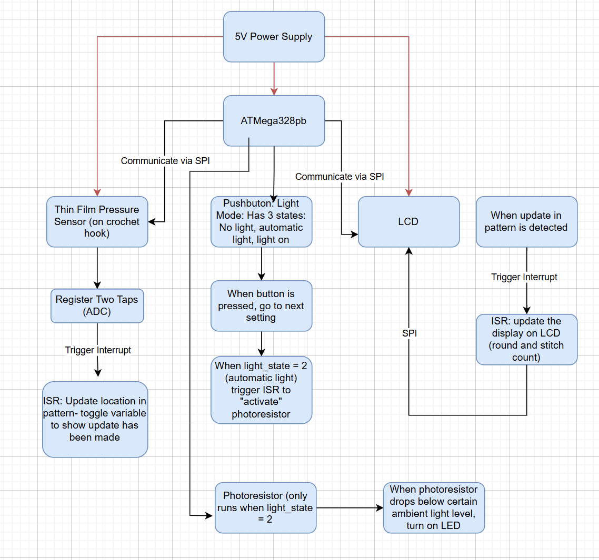

# final-project-skeleton

* **Team Number: 13**
* **Team Name: 𓆝 𓆟 slay 𓆞 𓆝**
* **Team Members: Hansika Doria, Amehja Williams, Parisa Khashayar**
* **GitHub Repository URL: https://github.com/upenn-embedded/final-project-s25-slay.git**
* **GitHub Pages Website URL: [for final submission]**

## Final Project Proposal

### 1. Abstract

*In a few sentences, describe your final project.*

> Our final project is a smart crochet hook. You will be able to upload a text file of a crochet pattern which will be displayed on an LCD screen. Using a pressure sensor on the needle, the user can signify when they have completed a stitch, and the LCD will update the pattern accordingly to keep track of where the user is in the pattern.

### 2. Motivation

*What is the problem that you are trying to solve? Why is this project interesting? What is the intended purpose?*

> When crocheting one needs to count the number of stitches they have made in order to ensure the dimensions of their project fit criteria. Oftentimes, this can be time-consuming and burdensome, especially for beginners.  The smart crochet needle attachment will be compatible with existing needles while enhancing crochet experience for newcomers and experts alike.  The attachment will track the number of stitches for artists.
>
> The most interesting aspect of this project is that the stitch count can be incremented or decremented by simply double-tapping or triple-tapping, respectively, the touch sensor.
>
> Overall, the purpose of the smart crochet needle attachment is to make stitch counting more efficient and streamlined for the crochet community.

### 3. System Block Diagram

*Show your high level design, as done in WS1 and WS2. What are the critical components in your system? How do they communicate (I2C?, interrupts, ADC, etc.)? What power regulation do you need?*

### 4. Design Sketches

*What will your project look like? Do you have any critical design features? Will you need any special manufacturing techniques to achieve your vision, like power tools, laser cutting, or 3D printing?*

> The project would be an attachment that can be added to a crochet hook such that the user can easily access the sensor used to determine when a stitch is complete. The casing of the attachment could be 3D printed along with what’s holding the LCD screen that is being used to keep track of the pattern and the stitch the user is on. Additionally, the components that are used in the attachment itself must be small but we would have an additional casing for other components not attached to the hook which do not have size constraints.
>
> 

### 5. Software Requirements Specification (SRS)

*Formulate key software requirements here. Think deeply on the design: What must your device do? How will you measure this during validation testing? Create 4 to 8 critical system requirements.*

*These must be testable! See the Final Project Manual Appendix for details. Refer to the table below; replace these examples with your own.*

> 1: The text file pattern that is uploaded must be kept updated at all times so that the user is crocheting correctly. This means that the interrupts that change the crochet pattern must work consistently
>
> 2: It’s important to make sure that the photoresistor does not toggle the LED when it is not supposed to. Ensuring that it is only controlling the LED when in the correct setting/mode.
>
> 3: Since the pressure sensor is in easy reach, it is very likely that the user will accidentally brush by it every so often. This means that in the code we need to make sure it can handle the difference between an intentional press and an accidental one. This can be handled with how long and hard the sensor  has been pressed on, as well as needing two presses to indicate a complete stitch.
>
> 4: Since the crochet pattern will be uploaded as a text file, we need to write a program that is able to understand the layout of crochet patterns. In order to keep track of the user's place, the code needs to know what each possible symbol means and how to decode it into a list of rounds and its subsequent stitches.

**5.1 Definitions, Abbreviations**

Here, you will define any special terms, acronyms, or abbreviations you plan to use for software

**5.2 Functionality**

| ID     | Description                                                                                                                    |
| ------ | ------------------------------------------------------------------------------------------------------------------------------ |
| SRS-01 | Upon a completed stitch, the current pointer of the pattern must update to the next stitch and show accordingly on the LCD     |
| SRS-02 | The photoresistor will only control the LED when the light_state mode is set to 2 (automatic light).                           |
| SRS-03 | Upon two significant (and non-accidental presses), the system will recognize a complete stitch and move along in the pattern.a |
| SRS-04 | The system must be able to create an array/list of the stitches and rounds once a pattern has been uploaded.                   |

### 6. Hardware Requirements Specification (HRS)

*Formulate key hardware requirements here. Think deeply on the design: What must your device do? How will you measure this during validation testing? Create 4 to 8 critical system requirements.*

*These must be testable! See the Final Project Manual Appendix for details. Refer to the table below; replace these examples with your own.*

> 1. A pressure sensor is required as the sensor used by the user to indicate when a stitch is complete. The data from this sensor can then be communicated to the MCU which then will adjust the counter being used to count down the pre-set amount of stitches required for the pattern that is being used. This can be measured through validation testing when a simple stitch pattern with a known amount of stitches is uploaded and the correct numbers decrementing can then be tested.
> 2. This value can then be displayed on the LCD which can also be tested by ensuring the correct number is being displayed by the LCD.
> 3. A photoresistor can be used, which would require an ADC pin to be used which can determine how light it is in order to turn an LED on in case the user is crocheting in the dark. The LED can have 3 settings which can be changed using a push button with 3 settings, light off, light on, and light adjusting based on the photoresistor. This can be tested by using the duty cycle to check how bright the LED is.
> 4. In addition, 2 coin cell batteries each supplying 3V will be put in series to have a 6V power source. This value can be measured to ensure that the value being outputted by the battery is as expected
> 5. The 6V power source needs to be brought down to 5V as per the requirements of the other components involved. Therefore a buck converter is necessary to bring the voltage down to the desired amount.

**6.1 Definitions, Abbreviations**

Here, you will define any special terms, acronyms, or abbreviations you plan to use for hardware

**6.2 Functionality**

| ID     | Description                                                                                                                            |
| ------ | -------------------------------------------------------------------------------------------------------------------------------------- |
| HRS-01 | A pressure sensor shall be used for stitch detection. The sensor shall detect two presses from the user to indicate a complete stitch. |
| HRS-02 | An LCD will be used to display the user's current pattern round, which will be updated via input from the pressure sensor.             |
| HRS-03 | A photoresistor will be used to detect when the LED should turn on to give the user light.                                             |
| HRS-04 | Two coin cell batteries will be used to power everything.                                                                             |
| HRS-05 | A buck converter will be used to step down the voltage from the two coin cell batteries (6V) to 5v.)                                   |

### 7. Bill of Materials (BOM)

*What major components do you need and why? Try to be as specific as possible. Your Hardware & Software Requirements Specifications should inform your component choices.*

*In addition to this written response, copy the Final Project BOM Google Sheet and fill it out with your critical components (think: processors, sensors, actuators). Include the link to your BOM in this section.*

**[https://docs.google.com/spreadsheets/d/1eGQhpZZsHFO__K_iJTvO_QplCVp1TaY8ozvFKA1TcYw/edit?usp=sharing](https://docs.google.com/spreadsheets/d/1eGQhpZZsHFO__K_iJTvO_QplCVp1TaY8ozvFKA1TcYw/edit?usp=sharing)**

### 8. Final Demo Goals

*How will you demonstrate your device on demo day? Will it be strapped to a person, mounted on a bicycle, require outdoor space? Think of any physical, temporal, and other constraints that could affect your planning.*

> For the final demo day, we will have a small example pattern already uploaded and will start crocheting it to see how the needle tracks each stitch. All we would need is the needle and some yarn..

### 9. Sprint Planning

*You've got limited time to get this project done! How will you plan your sprint milestones? How will you distribute the work within your team? Review the schedule in the final project manual for exact dates.*

Note: A), B), and C) corresponds to Task Categories/Assignments

| Milestone  | Functionality Achieved | Distribution of Work |
| ---------- | ---------------------- | -------------------- |
| Sprint #1  | Touch sensor increments & LCD screen Updates Stitch Count | A) Circuit assembly & touch sensor testing, B) LCD Screen Response C) CAD Design Drafts |
| Sprint #2  | Photoresistor automatically turns on LED, LED Button changes lighting modes | A) Photoresistor triggers LED Script, B) Button Lighting Modes Script, C) CAD Manufacturing  |
| MVP Demo   | Integration of functionality from Sprint #1, #2 |  A) Circuit Assembly Integration, B) CAD Finalization |
| Final Demo | Integrated functionality with completed CAD |  A) Complete device assembly including CAD and circuitry |

**This is the end of the Project Proposal section. The remaining sections will be filled out based on the milestone schedule.**

## Sprint Review #1

### Last week's progress

### Current state of project

### Next week's plan

## Sprint Review #2

### Last week's progress

### Current state of project

### Next week's plan

## MVP Demo

1. Show a system block diagram & explain the hardware implementation.
2. Explain your firmware implementation, including application logic and critical drivers you've written.
3. Demo your device.
4. Have you achieved some or all of your Software Requirements Specification (SRS)?

   1. Show how you collected data and the outcomes.
5. Have you achieved some or all of your Hardware Requirements Specification (HRS)?

   1. Show how you collected data and the outcomes.
6. Show off the remaining elements that will make your project whole: mechanical casework, supporting graphical user interface (GUI), web portal, etc.
7. What is the riskiest part remaining of your project?

   1. How do you plan to de-risk this?
8. What questions or help do you need from the teaching team?

## Final Project Report

Don't forget to make the GitHub pages public website!
If you’ve never made a GitHub pages website before, you can follow this webpage (though, substitute your final project repository for the GitHub username one in the quickstart guide):  [https://docs.github.com/en/pages/quickstart](https://docs.github.com/en/pages/quickstart)

### 1. Video

[Insert final project video here]

* The video must demonstrate your key functionality.
* The video must be 5 minutes or less.
* Ensure your video link is accessible to the teaching team. Unlisted YouTube videos or Google Drive uploads with SEAS account access work well.
* Points will be removed if the audio quality is poor - say, if you filmed your video in a noisy electrical engineering lab.

### 2. Images

[Insert final project images here]

*Include photos of your device from a few angles. If you have a casework, show both the exterior and interior (where the good EE bits are!).*

### 3. Results

*What were your results? Namely, what was the final solution/design to your problem?*

#### 3.1 Software Requirements Specification (SRS) Results

*Based on your quantified system performance, comment on how you achieved or fell short of your expected requirements.*

*Did your requirements change? If so, why? Failing to meet a requirement is acceptable; understanding the reason why is critical!*

*Validate at least two requirements, showing how you tested and your proof of work (videos, images, logic analyzer/oscilloscope captures, etc.).*

| ID     | Description                                                                                               | Validation Outcome                                                                          |
| ------ | --------------------------------------------------------------------------------------------------------- | ------------------------------------------------------------------------------------------- |
| SRS-01 | The IMU 3-axis acceleration will be measured with 16-bit depth every 100 milliseconds +/-10 milliseconds. | Confirmed, logged output from the MCU is saved to "validation" folder in GitHub repository. |

#### 3.2 Hardware Requirements Specification (HRS) Results

*Based on your quantified system performance, comment on how you achieved or fell short of your expected requirements.*

*Did your requirements change? If so, why? Failing to meet a requirement is acceptable; understanding the reason why is critical!*

*Validate at least two requirements, showing how you tested and your proof of work (videos, images, logic analyzer/oscilloscope captures, etc.).*

| ID     | Description                                                                                                                        | Validation Outcome                                                                                                      |
| ------ | ---------------------------------------------------------------------------------------------------------------------------------- | ----------------------------------------------------------------------------------------------------------------------- |
| HRS-01 | A distance sensor shall be used for obstacle detection. The sensor shall detect obstacles at a maximum distance of at least 10 cm. | Confirmed, sensed obstacles up to 15cm. Video in "validation" folder, shows tape measure and logged output to terminal. |
|        |                                                                                                                                    |                                                                                                                         |

### 4. Conclusion

Reflect on your project. Some questions to address:

* What did you learn from it?
* What went well?
* What accomplishments are you proud of?
* What did you learn/gain from this experience?
* Did you have to change your approach?
* What could have been done differently?
* Did you encounter obstacles that you didn’t anticipate?
* What could be a next step for this project?

## References

Fill in your references here as you work on your final project. Describe any libraries used here.
